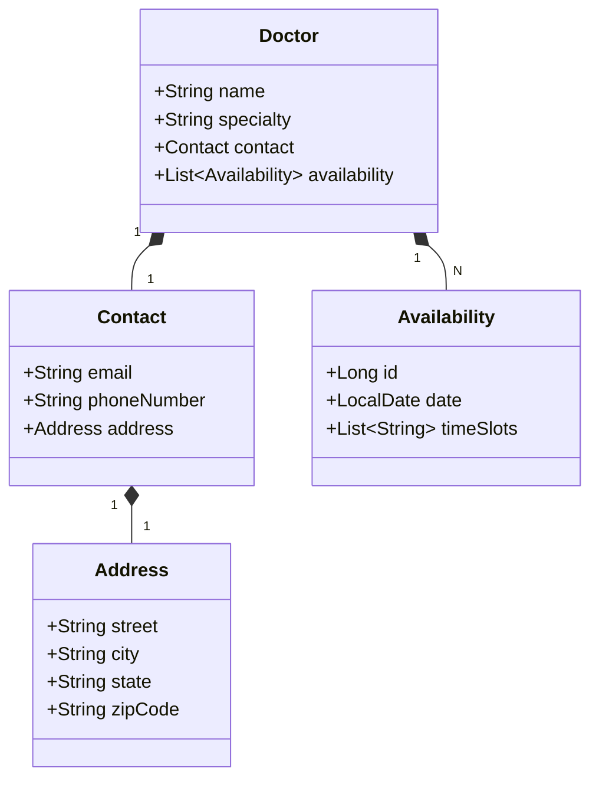

# Santander Dev Week 2024

Java RESTful API criada para a Santander Dev Week.

# Cadastro de Médicos e Especialidades com Disponibilidade

Este projeto tem como objetivo permitir que profissionais de saúde cadastrem suas especialidades, datas e horários disponíveis para que os pacientes possam agendar consultas.

## Tecnologias Utilizadas

- Java 17
- Spring Boot 3.3.1
- JPA/Hibernate
- H2 Database

## Estrutura do Projeto

O projeto está estruturado com as seguintes classes principais:

### Entidades

#### Doctor

Representa um médico.

## Diagrama de Classes (Domínio da API)

# Futuras Melhorias
- Implementar o cadastro de pacientes.
- Implementar o agendamento de consultas.
- Adicionar autenticação e autorização.
